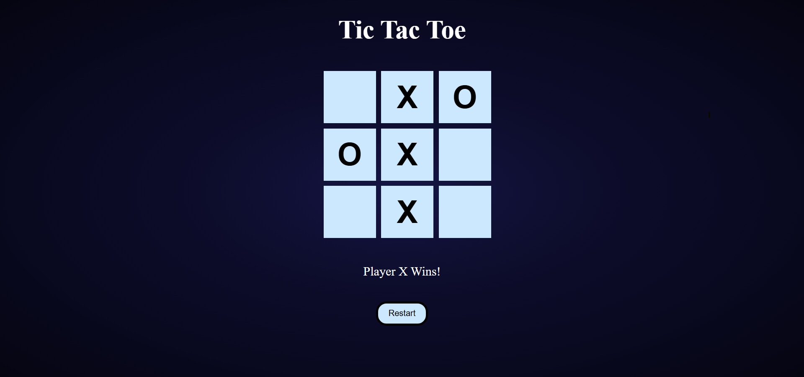

# Tic-Tac-Toe
# 🎮 Tic Tac Toe Game

A simple **Tic Tac Toe** game built using **HTML, CSS, and JavaScript**. This project is beginner-friendly and helps understand DOM manipulation, event handling, and basic game logic.

---

## 📂 Project Structure

```
Tic-Tac-Toe/
│── index.html
│── style.css
│── scripts.js
│── README.md
```

---

## 🚀 How to Run the Project

1. Download or clone this repository
2. Make sure all files are in the **same folder**
3. Open `index.html` in any modern web browser
4. Start playing 🎉

---

## 🕹️ How to Play

* The game is played on a **3×3 grid**
* Player **X** starts first
* Players take turns clicking on empty cells
* First player to align **3 symbols** (row, column, or diagonal) wins
* If all cells are filled and no one wins → **Draw**

---

## 🧠 Game Logic Explanation (Simple)

### 1️⃣ Board Representation

The board is stored in a JavaScript array:

```js
let board = ["", "", "", "", "", "", "", "", ""];
```

Each index represents one cell:

```
0 | 1 | 2
3 | 4 | 5
6 | 7 | 8
```

---

### 2️⃣ Player Turn Handling

```js
let currentPlayer = "X";
```

After every move:

```js
currentPlayer = currentPlayer === "X" ? "O" : "X";
```

---

### 3️⃣ Cell Click Logic

* Detect which cell is clicked using `data-index`
* Prevent clicking on filled cells
* Store the move in the board array
* Display `X` or `O` on the screen

---

### 4️⃣ Winning Logic

Winning combinations are predefined:

```js
const winPatterns = [
  [0,1,2],[3,4,5],[6,7,8],
  [0,3,6],[1,4,7],[2,5,8],
  [0,4,8],[2,4,6]
];
```

Each time a move is made, the game checks if any pattern matches.

---

### 5️⃣ Draw Condition

If all cells are filled and no winner is found:

```js
if (!board.includes(""))
```

The game ends in a draw.

---

### 6️⃣ Restart Game

The **Restart** button clears the board and starts a new game:

```js
resetGame();
```

---

## 🛠️ Technologies Used

* HTML5
* CSS
* JavaScript (DOM, Events)

---

## 🌟 Features

* Two-player mode (X vs O)
* Win & draw detection
* Restart game button
* Beginner-friendly code


## 📷 Screenshot (Optional)



## 👨‍💻 Author

Created by **Jaiv Patel**
